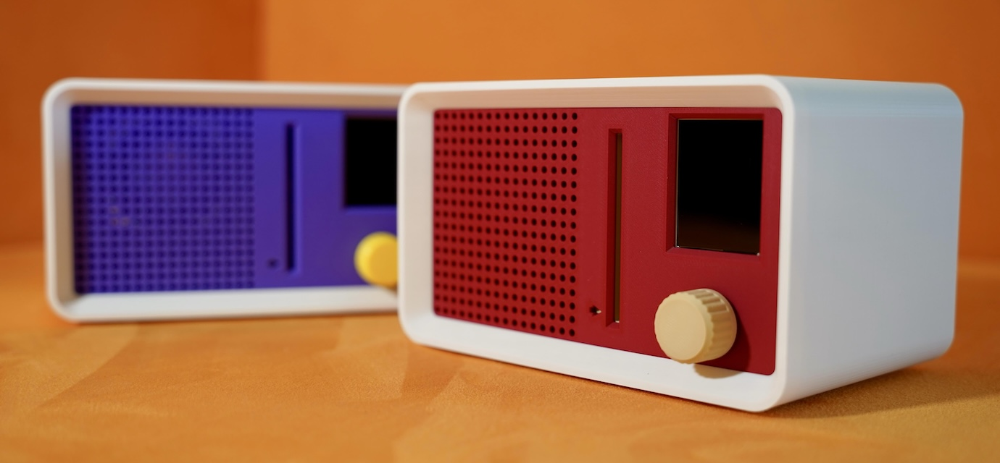
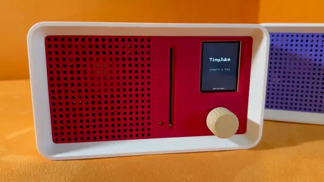
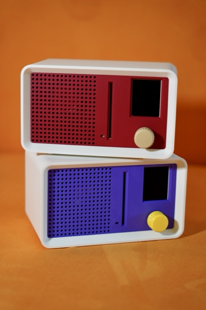
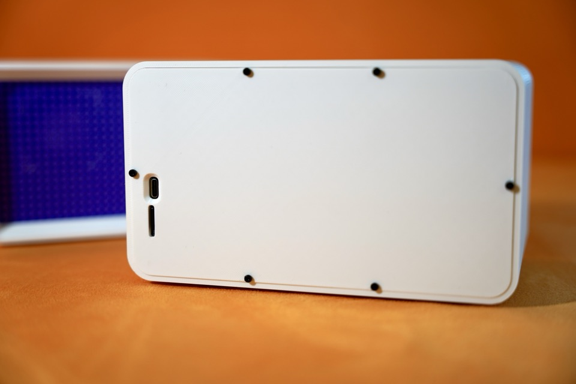
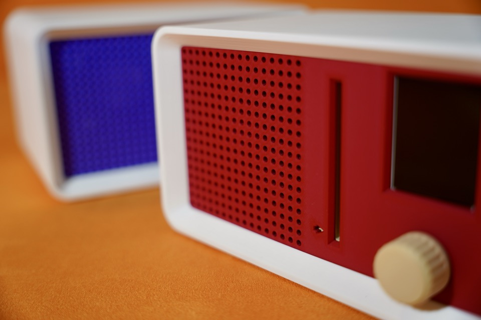
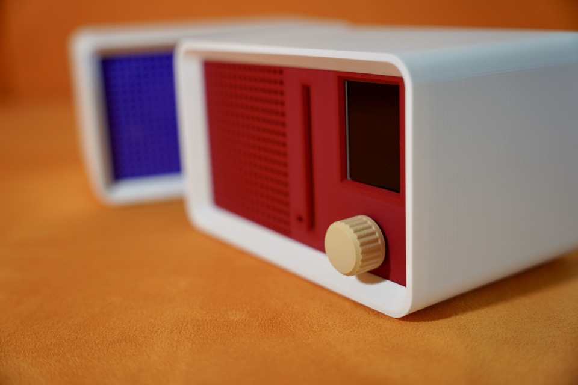
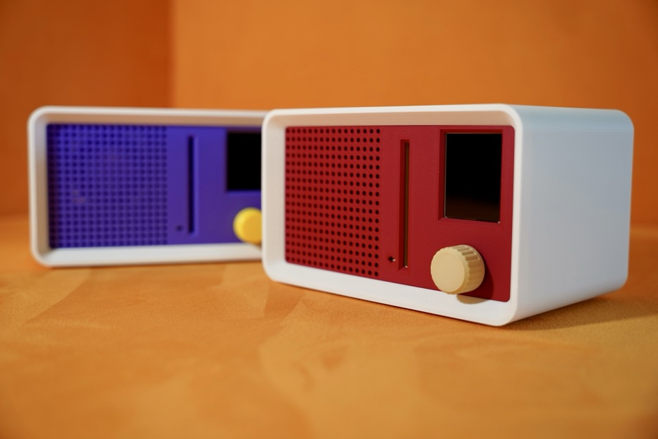

# TinyJuke



Your little one plays the same song over and over? Regular speakers too fiddly for
small hands? This little music box has you covered.

Slide a disk into the slot and its song plays. Pull it out and the music stops.
Swap it for another and the next song starts. That's the whole interface — a fun,
intuitive way for kids to put on their own music.

Each song is linked to an NFC sticker on a 3D-printed floppy disk (yes, I am that
old) — a real one shrunk to 75% — themed around the music it triggers. There are
no menus to browse and nothing to read, which is the point: it works for someone
who can't read yet. Or better still, write the song name on the disk and it
starts teaching them to read!

TinyJuke is an ESP32 project. It runs on a custom mainboard designed for it, but
any ESP32-WROVER board will do. You'll need to build the hardware and flash the
firmware yourself.

---

## What it does



*(silent — [same clip with sound](docs/img/demo-insert.mp4))*

- **Disk in, music plays.** Disk out, music stops. Leave it in and the track
  repeats.
- **A single knob** for everything: rotate for volume, click to confirm, hold to
  open the menu.
- **A 2" screen** showing album art, title, and artist.
- **Bluetooth speaker mode**, so grown-ups can play their own music through it.
- **A web app for setup.** The device hosts its own WiFi network — connect a
  phone or laptop, upload music, and link it to tags. No app to install, no
  account, no internet.
- **Firmware updates over WiFi**, protected by a PIN shown on the device screen.

Everything lives on a microSD card. Nothing is uploaded anywhere.

---

## What you need



| Part        | What to get                                        |
|-------------|----------------------------------------------------|
| Mainboard   | The TinyJuke PCB — ESP32-WROVER-E N8R8 (8 MB flash, 8 MB PSRAM) |
| NFC reader  | Elechouse PN532 (red board)                        |
| Speaker     | 4 Ω, 3 W, mono                                     |
| Display     | 2.0" ST7789V TFT, 240×320                          |
| Knob        | KY-040 rotary encoder                              |
| Storage     | microSD card, formatted FAT32                      |
| Tags        | NTAG213/215/216 stickers — one per disk, or any ISO14443A card |
| Amplifier   | MAX98357A I²S board — **only for a dev-board build** |

The mainboard is a custom PCB built around the ESP32-WROVER-E N8R8 module, and
it's what the firmware builds for by default. **The MAX98357A amplifier is
already on it**, so you only need to buy one if you're building on a dev board.

**Any other ESP32-WROVER board works just as well** — the Lolin D32 Pro is fully
supported and has its own build environment, and the project was developed on one
before the PCB existed. Going that route, you'll wire up a separate MAX98357A
breakout.

> **Get a module with PSRAM.** WROVER modules have it; the otherwise similar
> WROOM-32 does not. Album art is decoded and scaled in PSRAM, and without it
> there isn't enough room in regular RAM to hold a cover image — the firmware
> still runs and plays music, it just skips the artwork. If you're picking a
> board, that's the spec that matters.

Plus a soldering iron and some wire if you're building on a dev board rather
than the PCB. Wiring diagrams for both pin maps are in the
[Technical Reference](docs/technical-reference.md#1-hardware).

---

## Getting started

**1. Wire it up.** On the TinyJuke PCB the wiring is already done — plug in the
display, reader, encoder, and speaker. Set the PN532's DIP switches to HSU mode
and you're ready to flash.

On a dev board, follow the [wiring tables](docs/technical-reference.md#14-wiring)
and add the MAX98357A breakout. Besides the PN532's HSU switches, the detail
that's easiest to get wrong is the amplifier's GAIN pin: tie it to GND rather
than leaving it floating.

**2. Flash the firmware.** Flashing is over the USB-C port on the back.

<!--  -->

Install [PlatformIO](https://platformio.org/), then pick the environment for
your board:

```bash
# TinyJuke PCB (ESP32-WROVER-E N8R8) — the default, so no -e needed:
~/.platformio/penv/bin/pio run -t upload

# Lolin D32 Pro — check which flash variant you have first:
esptool.py flash_id
~/.platformio/penv/bin/pio run -e lolin_d32_pro     -t upload   # 16 MB board
~/.platformio/penv/bin/pio run -e lolin_d32_pro-4mb -t upload   # 4 MB board
```

The two boards use **different pin assignments** — the environment you pick
selects the right one, so there's nothing to edit. The full list of
environments, including a no-PSRAM build for a plain Lolin D32, is in the
[build profiles](docs/technical-reference.md#32-build-profiles). For any other
WROVER board, start from whichever pin map is closer to how you've wired it.

> The Lolin D32 Pro ships in 4 MB and 16 MB versions with **identical
> markings**. Using the wrong environment boot-loops the device. When in doubt,
> run `esptool.py flash_id`.

**3. Prepare the SD card.** Format it FAT32 and insert it. That's enough — the
device creates the folders it needs on first boot, and you'll add music through
the web app in a moment.

**4. Power it on.** You should see the waiting screen. If the screen reports an
SD error or the device hangs on the NFC reader, check
[troubleshooting](docs/technical-reference.md#5-troubleshooting).

---

## Using it

### Playing music

<!--  -->

The idle screen says **insert a tag**. Slide a disk into the slot on the front and
whatever track is linked to it starts from the beginning, with its album art on
screen.

- Leave the disk in and the track repeats.
- Swap in a different disk and it switches immediately.
- Pull the disk out and playback stops.

### The knob

<!--  -->

| Gesture | While playing / waiting     | In a menu                 |
|---------|-----------------------------|---------------------------|
| Hold    | Open the menu               | Go back                   |
| Rotate  | Volume                      | Move between items        |
| Click   | Save volume                 | Select / confirm          |

Hold is about 0.6 seconds. While you hold, a line grows along the bottom edge of
the screen — it appears after a moment and reaches full width exactly when the
hold registers, so you can see how much longer to keep pressing. Let go early
and nothing happens.

The menu selection glides between entries as you turn, and the volume and
brightness bars ease toward their new level. The actual volume and backlight
change the instant you turn the knob; only the bar is animated.

### The menu

Hold the knob from the waiting screen to open it.
[Here is the whole menu, end to end](docs/img/demo-menu.mp4) (MP4, 72 s).

<!-- Inline player hidden: GitHub strips <video> with a relative src, so this
     renders as nothing in the README. The link above works in both places.
<video src="docs/img/demo-menu.mp4" controls muted playsinline preload="metadata" width="640">
</video>
-->


| Item               | What it does                                                            |
|--------------------|-------------------------------------------------------------------------|
| **Web Management** | Starts the WiFi network and web app for adding music and tags, or updating firmware|
| **Bluetooth Mode** | Turns the device into a Bluetooth speaker                               |
| **Volume**         | Volume and Max Volume (see below)                                       |
| **Brightness**     | Screen backlight                                                        |
| **Color Theme**    | Select different color theme                                            |
| **Power Saving**   | Turn the screen off after idling — Off / 5 / 15 / 30 / 60 min           |
| **Sleep Timer**    | Stop the music after a while — Off / 15 / 30 / 60 / 120 min             |
| **Version**        | Firmware version, plus a QR code linking to the latest release          |
| **Reboot**         | Restarts the device (hold to confirm, click or rotate to cancel)        |

Web Management and Bluetooth Mode can't run at the same time, so choosing one
disables the other.

**Volume vs. Max Volume.** The Volume screen has two settings; click to switch
between them, hold to save both. Max Volume is the ceiling you set once so the
box can't get too loud — in normal playback the volume knob keeps its full 0–100%
range and the real loudness is volume × max volume (80% volume at 50% max gives
40%). In Bluetooth mode it's a hard cap instead, and it also limits what the
phone's own volume slider can do.

**Power Saving** only blanks the screen; the device stays awake, and inserting a
disk or touching the knob brings it back.

**Sleep Timer** shows a countdown on screen while music plays and stops the audio
when it reaches zero. Pull the disk out and put it back to start playing again.

---

## Bluetooth speaker mode

Open the menu and pick **Bluetooth Mode**. The device advertises itself as
`TinyJuke-XXXX` (the last four characters are unique to your device). Pair from a
phone and play from any app.

While connected:

- **Rotate** to change volume — it stays in sync with the phone's slider.
- **Hold** to leave Bluetooth and go back to the menu.
- **Slide a disk in** and you'll be asked whether to switch back to jukebox mode.
  Click to switch, hold to dismiss, or just pull the disk back out.
- Track title and artist appear on screen when the phone sends them.
- The Sleep Timer works here too.

---

## Adding your own music

Open the menu and pick **Web Management**. The screen shows the network name and
a PIN. On your phone or laptop:

1. Join the **TinyJuke-Setup** WiFi network (password `12345678`).
2. Open **http://192.168.4.1** in a browser.

You'll get a three-tab web app.

**Tags** — the disk library. Add a tag, and while the dialog is open you can just
slide the disk into the slot to fill in its ID automatically. Pick a track,
optionally set a title, artist, and album art, and save. If you insert a disk
that's already registered, it tells you instead of letting you create a
duplicate.

**Music** — everything on the SD card, with size, duration, and embedded metadata.

- **Upload** WAV, MP3, M4A, AAC, OGG, or FLAC. Anything that isn't already a WAV
  gets converted in your browser before it uploads, so the device only ever
  receives WAV.
- **Cover art comes along for the ride.** If an MP3, M4A, or FLAC has embedded
  artwork, it's cropped, resized, and uploaded automatically, ready to pick in the
  tag editor.
- **Edit titles and artists** directly. For files uploaded through this app the
  change is instant. For files you copied onto the SD card by hand, the first edit
  rewrites the file and can take up to a minute for a long track — the device
  shows a progress bar.
- **Delete** a track, and any tags pointing at it are removed too (you'll see the
  list before confirming).

**System** — the running firmware version, and firmware updates. Pick a `.bin`
file, enter the PIN shown on the device screen, and the device flashes itself and
reboots. The PIN exists so that being on the WiFi isn't by itself enough to
reflash the box.

> Two caveats on updates: the very first flash after upgrading from firmware
> older than v1.6.0 has to be done over USB, and there's no automatic rollback —
> an update that boots but misbehaves needs a USB reflash.

You can also just copy files onto the SD card from a computer. Put audio in
`/music/`, artwork in `/img/`, and the device picks them up on the next boot.

---

## Something's wrong

Common problems and what to check are in the
[troubleshooting table](docs/technical-reference.md#5-troubleshooting). For boot
diagnostics, connect over USB and run
`~/.platformio/penv/bin/pio device monitor` at 115200 baud.

---

## Documentation

Browse it online at **[qxzzxq.github.io/TinyJuke](https://qxzzxq.github.io/TinyJuke/)**,
or read the Markdown here:

| Document | What's in it |
|---|---|
| [docs/technical-reference.md](docs/technical-reference.md) | Wiring, pin maps, SD card format, build profiles, HTTP API, troubleshooting |
| [docs/esp32_wrover_e_pin_map.md](docs/esp32_wrover_e_pin_map.md) | Pin allocation for the custom WROVER-E mainboard |
| [CLAUDE.md](CLAUDE.md) | Firmware architecture, design decisions, and contributor workflow |
| [TinyJuke_mainboard_v2_1-P1_2026-06-11.png](docs/TinyJuke_mainboard_v2_1-P1_2026-06-11.png) | Schematic of the TinyJuke PCB |

---

## Status

<!--  -->

**Milestone 4, in progress.** Working today: tag-triggered playback with hot-swap,
album art, the encoder GUI with themes and timers, the web app for tags and music,
Bluetooth speaker mode, and over-the-air firmware updates.

Recent additions include web-based music management (edit metadata, delete with
tag cascade), OTA updates from the System tab, and a max-volume ceiling.

---

## License

This is an open-hardware project, so the code, the hardware design, and the
documentation are licensed separately. All three are copyleft: you can use,
modify, and redistribute the project, but anything you build from it has to stay
open under the same license.

| Part | Covers | License |
|------|--------|---------|
| Firmware / source code | `src/`, `test/`, `platformio.ini`, partition tables, build config | [GPL-3.0-or-later](LICENSE) |
| Hardware design | PCB schematics & board layout in `docs/` | [CERN-OHL-S-2.0](LICENSES/CERN-OHL-S-2.0.txt) |
| Documentation & enclosure | `README.md`, `docs/*.md`, design notes, 3D-printable enclosure files | [CC-BY-SA-4.0](LICENSES/CC-BY-SA-4.0.txt) |

Copyright © 2026 qxzzxq.

Third-party components keep their own licenses and are not covered by the above:

- PN532 NFC library (`lib/PN532*`): BSD 3-Clause (Adafruit / Seeed), see `lib/PN532/license.txt`
- Arduino_GFX: BSD (Adafruit-derived)
- ArduinoJson: MIT
- ESP32-A2DP: Apache-2.0
- QRCode (ricmoo): MIT
- arduino-esp32 core (SD, WiFi, WebServer, SPI, I2S): LGPL-2.1

These are all GPL-compatible, so the firmware as a whole ships under
GPL-3.0-or-later.
